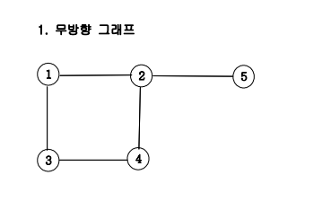
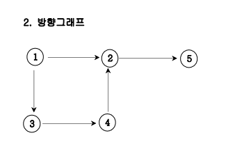
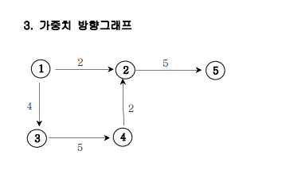

# 11. 그래프와 인접행렬

### 구분

Graph

### 설명

<ol>
    <li>무방향 그래프</li>
        

            
        

    <li>방향 그래프</li>
        

            
        

    <li>가중치 방향 그래프</li>
        

            
        

</ol>