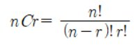
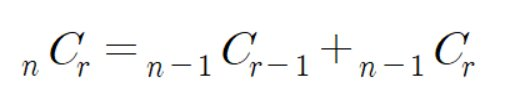

# 조합의 경우수(메모이제이션)

### 구분

DFS

### 설명

    로 계산합니다.

하지만 여러분은 이 공식을 쓰지않고 다음 공식을 사용하여 재귀를 이용해 조합수를 구해주는 프로그램을 작성하세요.

### 입력

첫째 줄에 자연수 n(3<=n<=33)과 r(0<=r<=n)이 입력됩니다.

### 출력

첫째 줄에 조합수를 출력합니다.

### 예시 입력 1

<pre>5 3</pre>

### 예시 출력 1

<pre>10</pre>

### 예시 입력 2

<pre>33 19</pre>

### 예시 출력 2

<pre>818809200</pre>