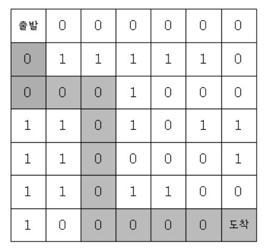

# 미로탐색

### 구분

DFS

### 설명

7*7 격자판 미로를 탈출하는 경로의 가지수를 출력하는 프로그램을 작성하세요.

출발점은 격자의 (1, 1) 좌표이고, 탈출 도착점은 (7, 7)좌표이다. 격자판의 1은 벽이고, 0은 통로이다.

격자판의 움직임은 상하좌우로만 움직인다. 미로가 다음과 같다면

위의 지도에서 출발점에서 도착점까지 갈 수 있는 방법의 수는 8가지이다.

### 입력

7*7 격자판의 정보가 주어집니다.

### 출력

첫 번째 줄에 경로의 가지수를 출력한다.

### 예시 입력 1

<pre>0 0 0 0 0 0 0
0 1 1 1 1 1 0
0 0 0 1 0 0 0
1 1 0 1 0 1 1
1 1 0 0 0 0 1
1 1 0 1 1 0 0
1 0 0 0 0 0 0</pre>

### 예시 출력 1

<pre>8</pre>