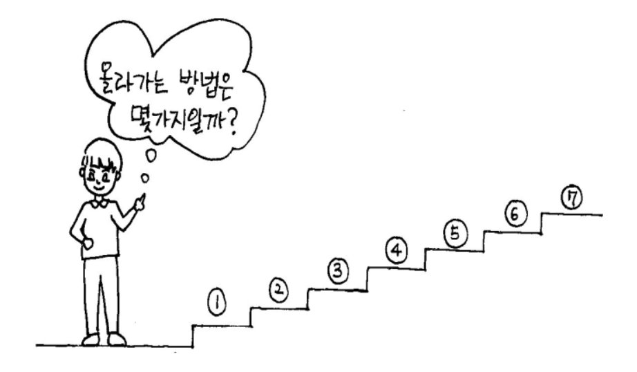

# 1. 계단오르기

### 구분

Dynamic Programming

### 설명

철수는 계단을 오를 때 한 번에 한 계단 또는 두 계단씩 올라간다. 만약 총 4계단을 오른다면 그 방법의 수는

1+1+1+1, 1+1+2, 1+2+1, 2+1+1, 2+2 로 5가지이다.

그렇다면 총 N계단일 때 철수가 올라갈 수 있는 방법의 수는 몇 가지인가?

### 입력

첫째 줄은 계단의 개수인 자연수 N(3≤N≤35)이 주어집니다.

### 출력

첫 번째 줄에 올라가는 방법의 수를 출력합니다.

### 예시 입력 1

<pre>7</pre>

### 예시 출력 1

<pre>21</pre>