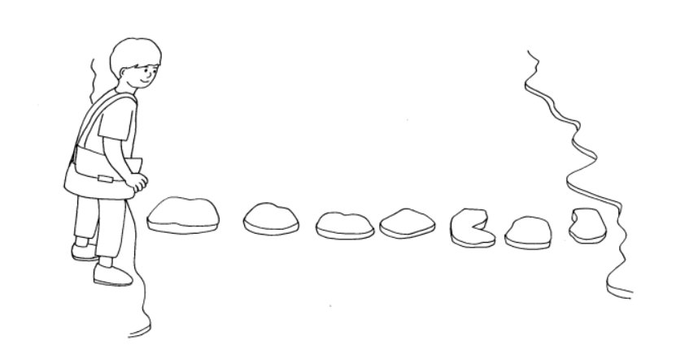

# 2. 돌다리 건너기

### 구분

Dynamic Programming

### 설명

철수는 학교에 가는데 개울을 만났습니다. 개울은 N개의 돌로 다리를 만들어 놓았습니다.

철수는 돌 다리를 건널 때 한 번에 한 칸 또는 두 칸씩 건너뛰면서 돌다리를 건널 수 있습니다.

철수가 개울을 건너는 방법은 몇 가지일까요?

### 입력

첫 번째 줄에 개울을 건너는 방법의 수를 출력합니다.

### 출력

첫 번째 줄에 개울을 건너는 방법의 수를 출력합니다.

### 예시 입력 1

<pre>7</pre>

### 예시 출력 1

<pre>34</pre>